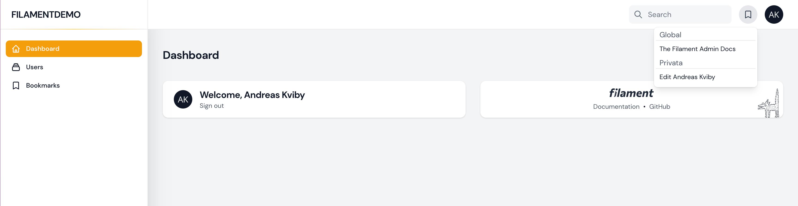
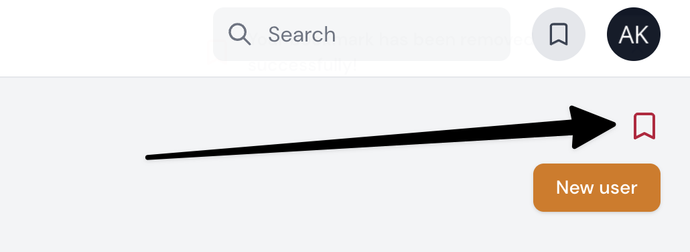

# Filament Bookmarks for Filament Admin

[](https://packagist.org/packages/stafe-group-ab/filament-bookmarks-menu)
[](https://packagist.org/packages/stafe-group-ab/filament-bookmarks-menu)





This Filament Plugin will add a bookmarks menu to your Filament Admin application. You can setup global items in this menu or let users add their own items.
The plugin will render an add & remove bookmark icon on top of all pages where you want it.

## Installation

You can install the package via composer:

```bash
composer require stafe-group-ab/filament-bookmarks-menu
```

You can publish and run the migrations with:

```bash
php artisan vendor:publish --tag="filament-bookmarks-menu-migrations"
php artisan migrate
```

You can publish the config file with:

```bash
php artisan vendor:publish --tag="filament-bookmarks-menu-config"
```

This is the contents of the published config file, here you can alter icons, colors and more with ease.

```php
return [
    'bookmark_icon' => 'heroicon-o-bookmark',
    'bookmark_class' => 'w-5 h-5 cursor-pointer text-gray-700 dark:text-gray-200',
    'add_bookmark_icon' => 'heroicon-o-bookmark',
    'remove_bookmark_icon' => 'heroicon-s-bookmark',
    'add_bookmark_class' => 'w-6 h-6 cursor-pointer text-danger-700 dark:text-gray-200',
    'remove_bookmark_class' => 'w-6 h-6 cursor-pointer text-danger-700 dark:text-gray-200',
    'add_bookmarks_by_users' => true,
    'exclude_pages' => ['admin', 'bookmarks-menus'],
    'notification_add_icon' => 'heroicon-o-bookmark',
    'notification_remove_icon' => 'heroicon-o-bookmark',
    'notification_add_color' => 'success',
    'notification_remove_color' => 'danger',
    'show_resource_in_navigation' => false,
];
```

Optionally, you can publish the views using

```bash
php artisan vendor:publish --tag="filament-bookmarks-menu-views"
```

Optionally, you can publish the translation files, we will ship in English only

```bash
php artisan vendor:publish --tag="filament-bookmarks-menu-translations"
```

## Usage
To offer your logged in users the ability to add favorites to their personal bookmarks menu
make sure you go to the config file and set the below. That will make the plugin
render the add / remove bookmark icon feature on all pages.
```php
 'add_bookmarks_by_users' => true,
```

In almost all cases there will be pages that you want to exclude from
this plugin. There is an array in the config file where you can add
the exclusions you want. It will exclude in the ending string in all
urls in your Filament Admin. So if you exclude edit below no edit pages 
will be available in the plugin.
```php
'exclude_pages' => ['admin', 'bookmarks-menus'],
```


## Testing

```bash
composer test
```

## Changelog

Please see [CHANGELOG](CHANGELOG.md) for more information on what has changed recently.

## Contributing

Please see [CONTRIBUTING](CONTRIBUTING.md) for details.

## Security Vulnerabilities

Please review [our security policy](../../security/policy) on how to report security vulnerabilities.

## Credits

- [Andreas Kviby, Stafe Group](https://github.com/STAFE-GROUP-AB)
- [All Contributors](../../contributors)

## License

The MIT License (MIT). Please see [License File](LICENSE.md) for more information.
